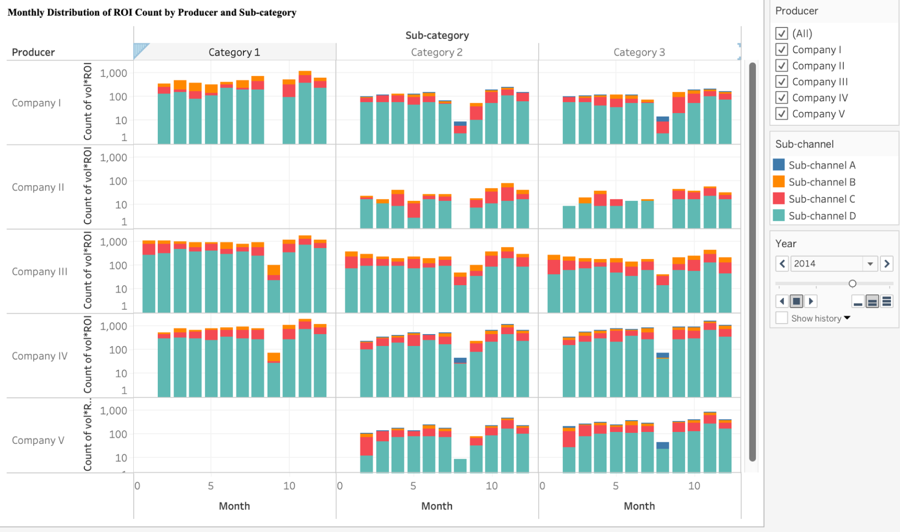
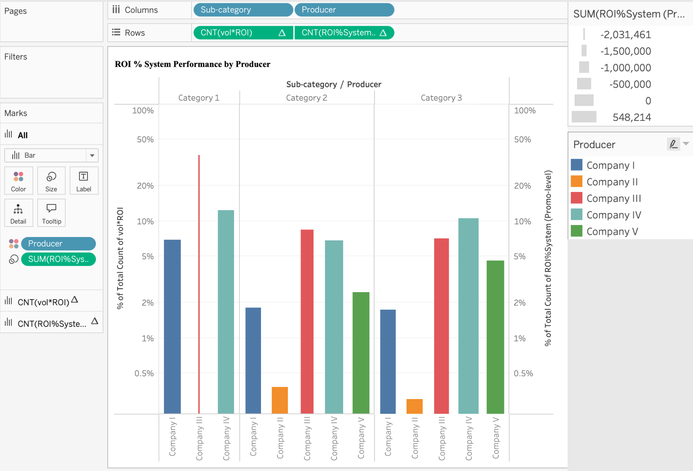
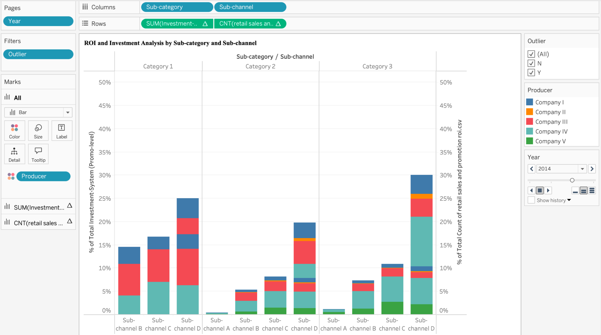

# 📊 Retail Sales & Promotion ROI Analysis

## 🔍 Overview
This project analyzes retail sales and promotional performance using Tableau to understand how investment impacts sales and ROI across different producers, sub-channels, and categories.

---

## 🎯 Objectives
- Analyze sales and promotional investment trends  
- Evaluate ROI efficiency across producers  
- Identify seasonal and category-based patterns  
- Provide data-driven business insights  

---
## 📁 Dataset

The dataset used in this project contains retail sales and promotion ROI data (2012–2015).

Due to file size limitations, it is not included in this repository.

🔗 **Download Dataset:**  
👉 [Click here to download from Google Drive](https://drive.google.com/file/d/1qiUie5zpW_jkDZ934d54CqjYEDO5EFLH/view?usp=sharing)
---

## 📊 Visualizations

### 📈 Monthly ROI Distribution

Shows how ROI varies across months for different producers and categories.

---

### 📊 ROI Performance by Producer

Compares each producer’s contribution to total ROI.

---

### 📊 ROI vs Investment Analysis

Shows how ROI changes with different levels of investment across sub-channels.

---

## 📄 Project Report

You can view the complete project documentation here:

- 📊 [Presentation (PPT)](docs/project_report.pptx)  
- 📄 [Detailed Report (PDF)](docs/project_report.pdf)

---

## 🛠️ Tools Used
- Tableau  
- CSV Dataset  

---

## 📂 Project Structure

- **docs/** → Project report files (PPT & PDF)  
- **images/** → Visualization screenshots  
- **tableau/** → Tableau workbook  
- **README.md** → Project documentation  

---

## 💡 Key Insights

- Promotional investment does not always lead to higher sales  
- ROI varies significantly across producers and sub-channels  
- Certain categories show inefficient spending patterns  
- A few producers dominate overall performance    

---

## 📌 Conclusion
This analysis helps businesses optimize promotional strategies by focusing on high-performing channels and reducing inefficient investments.

---

⭐ This project is part of my Data Analytics portfolio.
